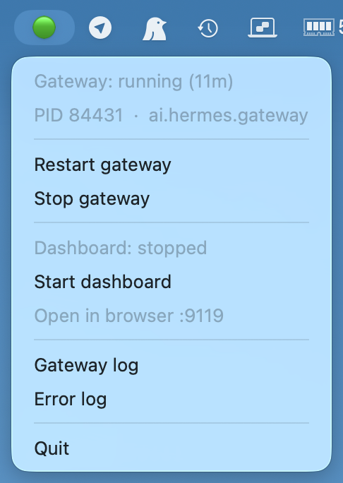

# HermesMenuBar

macOS menu bar app that shows Hermes' status and drives the gateway's launchd service.

<table>
<tr>
<td align="center"><br><sub><b>English</b></sub></td>
<td align="center"><br><sub><b>Italiano</b></sub></td>
</tr>
</table>

Gateway and dashboard each have a start/stop toggle. "Open in browser" is greyed out above because the dashboard is not answering on the port. The menu follows the system language — see [Language](#language).

## What it drives

Hermes runs as **two** separate processes:

| | What it is | Lifecycle |
|---|---|---|
| **gateway** | the service that makes Telegram & co. work | launchd agent `ai.hermes.gateway`, starts at login, `KeepAlive` |
| **dashboard** | the web UI on :9119 | foreground process, dies with the terminal |

The app tracks the gateway through `launchctl` and probes the dashboard with a TCP connect. The PID is re-read on every tick (3s): `KeepAlive` can restart the gateway at any moment, so it is never cached.

## Installation

```bash
./install.sh      # installs rumps if missing, registers the agent, starts the app
./uninstall.sh    # removes everything
```

After `install.sh` the app is already running and comes back at every login — no need to start it by hand.

## Commands

### Menu bar app

```bash
L=dev.trapias.hermes-menubar

launchctl list $L                    # status + PID
launchctl kickstart -k gui/$UID/$L   # restart (also how you reload the code)
launchctl bootout   gui/$UID/$L      # stop
launchctl bootstrap gui/$UID ~/Library/LaunchAgents/$L.plist   # start again
```

By hand, outside launchd — useful to see errors on screen:

```bash
cd ~/Dev/Priv/HermesMenuBar
~/.hermes/hermes-agent/venv/bin/python hermes_menubar.py
```

### Gateway

```bash
hermes gateway status
hermes gateway start | stop | restart
hermes gateway install --force       # regenerate the plist (needed after a PATH change)
tail -f ~/.hermes/logs/gateway.log
```

### Dashboard

```bash
hermes dashboard --no-open           # start (foreground, dies with the terminal)
hermes dashboard --status            # list the running web servers
hermes dashboard --stop              # stop all web servers
```

The app launches it detached (`start_new_session`), so a dashboard started from the menu outlives both the terminal and the menu bar app itself.

### Logs

| What | Where |
|---|---|
| menu bar app | `~/Library/Logs/hermes-menubar.error.log` |
| dashboard started from the menu | `~/Library/Logs/hermes-dashboard.log` |
| gateway | `~/.hermes/logs/gateway.log` · `gateway.error.log` |

The agent is `dev.trapias.hermes-menubar` — a deliberately separate namespace: Hermes sweeps `ai.hermes.gateway*` and `hermes update` touches `ai.hermes.*`, so a plist in there would risk being wiped out by an update.

`LimitLoadToSessionType: Aqua` because a menu bar needs a graphical session: the app is not loaded in SSH or background sessions.

## Language

The UI ships in English and Italian — both are shown side by side at the top of this README. On startup the app reads the system's preferred languages (`AppleLanguages`, i.e. System Settings › Language & Region) and picks the first one it can speak, falling back to English:

| System languages | Menu |
|---|---|
| `it-IT` | Italian |
| `en-GB`, `it` | English |
| `fr-FR`, `it`, `en` | Italian — the first *supported* entry wins |
| `de-DE` | English |

To pin a language regardless of the system, set `HERMES_MENUBAR_LANG` (`en` or `it`; an unknown value falls back to English):

```bash
HERMES_MENUBAR_LANG=en ./install.sh
```

It has to go through `install.sh` because launchd agents do not inherit the shell environment — exporting the variable in your terminal has no effect on the app started at login. `install.sh` writes it into the generated plist, so it also survives a reinstall.

To change it on an installed agent without reinstalling:

```bash
L=dev.trapias.hermes-menubar
/usr/libexec/PlistBuddy -c "Set :EnvironmentVariables:HERMES_MENUBAR_LANG en" \
    ~/Library/LaunchAgents/$L.plist          # 'Add' instead of 'Set' the first time
launchctl kickstart -k gui/$UID/$L
```

Running by hand, the plain environment variable works as usual:

```bash
HERMES_MENUBAR_LANG=it ~/.hermes/hermes-agent/venv/bin/python hermes_menubar.py
```

Adding a language means adding one entry to `STRINGS` in `hermes_menubar.py`. English is the base: `t()` falls back to it key by key, so a partial translation degrades to English strings instead of breaking the menu.

## Notes

- Slow operations (`hermes gateway restart`, starting the dashboard) run on a separate thread: rumps lives on Cocoa's main thread and would freeze.
- The **gateway** plist is static. If you change PATH (new Node via nvm, ffmpeg via brew), run `hermes gateway install` again or the gateway keeps the old PATH.
- Logs open in Console.app, which follows them in real time.

## Configuration

Through environment variables, read at startup:

| Var | Default |
|---|---|
| `HERMES_HOME` | `~/.hermes` |
| `HERMES_DASHBOARD_PORT` | `9119` |
| `HERMES_MENUBAR_LANG` | *(system language, else `en`)* |
